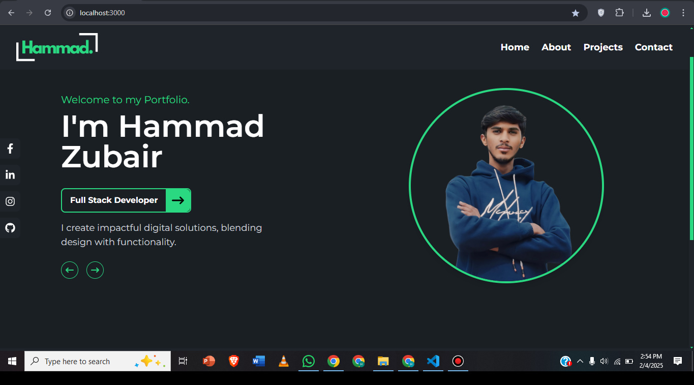
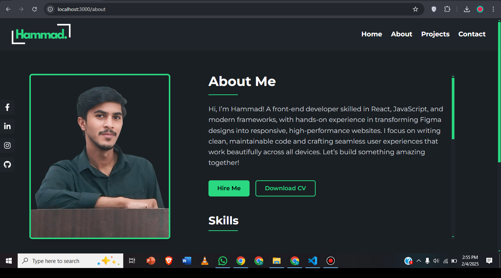
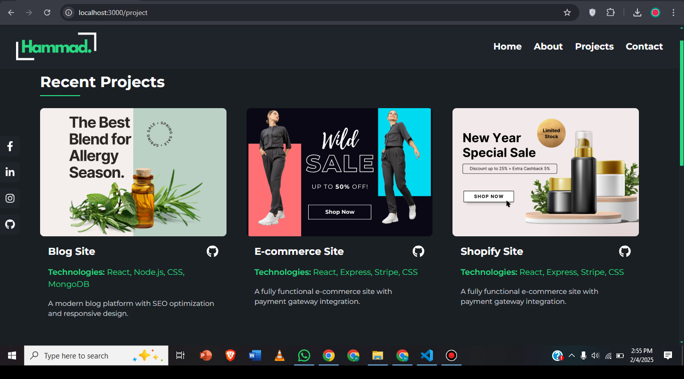
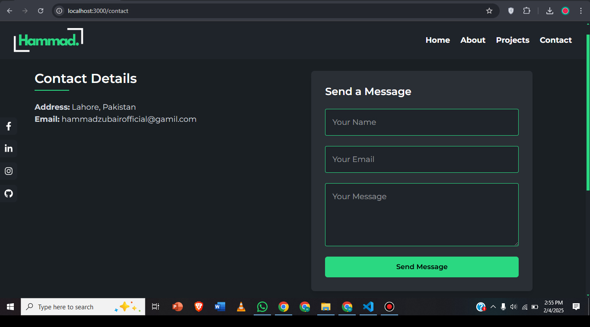

# 🚀 Hammad Zubair - Portfolio Website

Welcome to my personal **Portfolio Website**, where I showcase my skills, projects, and experience in web development. This site is designed with **React.js** and modern web technologies to provide a smooth and engaging user experience. 🌐

---

## 📌 Live Demo

**Check out my portfolio live at:** [\[Coming Soon\]](https://hammadportfolio-rose.vercel.app/)

## 📸 Preview

### 🔹 Website Screenshots







---

## 📂 Project Structure

```
Hammad-Portfolio/
│-- src/
│   ├── assets/               # Images & other media
│   ├── components/           # Reusable React components
│   ├── constants/            # Centralized data storage (Home, About, Projects, Contact) 
│   ├── App.js                # Main application entry point
│   ├── index.js              # React entry point
│-- public/                   # Static files
│-- package.json              # Dependencies & scripts
│-- README.md                 # Documentation
```

---

## 🎨 Tech Stack

- **Frontend:** React.js, Tailwind CSS, Framer Motion
- **Version Control:** Git & GitHub
- **Deployment:** Vercel
- **Design Tools:** Figma

---

## 🌟 Features

✅ **Fully Responsive** - Works across all devices  
✅ **Downloadable CV** - Available for potential employers  
✅ **Smooth Animations** - Framer Motion for seamless transitions  
✅ **Project Showcase** - Displays my best work  
✅ **Testimonials** - Feedback from satisfied clients  
✅ **Social Links** - Easily connect with me  
✅ **Fast Performance** - Optimized for speed  

---

## 🛠️ How to Run Locally

1. **Clone the repository**
   ```sh
   git clone https://github.com/Hammad-Zubair-off/Portfolio.git
   ```
2. **Navigate into the project folder**
   ```sh
   cd Portfolio
   ```
3. **Install dependencies**
   ```sh
   npm install
   ```
4. **Start the development server**
   ```sh
   npm start
   ```
5. Open **[http://localhost:3000/](http://localhost:3000/)** in your browser

---

## 📜 Sections Overview

### 🏠 Home

- Engaging introduction with multiple greetings
- Dynamic hero section displaying my title & skills

### 📖 About Me

- My background, skills, and education
- Downloadable CV button
- Hire button (redirect to Contact Form)

### 💻 Projects

- Showcasing my best projects with **GitHub links**
- Technologies used in each project

### 🌟 Testimonials

- Feedback from clients 

### 📩 Contact

- Easy-to-use contact form
- Social media links

---


## 📬 Contact Me

📧 Email: [[hammadzubairofficial@gmail.com](mailto:hammadzubairofficial@gmail.com)]  
🔗 LinkedIn: [linkedin.com/in/hammad-zubair-off](https://www.linkedin.com/in/hammad-zubair-off/)  
🐙 GitHub: [github.com/Hammad-Zubair-off](https://github.com/Hammad-Zubair-off)  

---

## 🏁 License

This project is **open-source** and available under the **MIT License**. Feel free to use and modify it as needed!

---

## ⭐ Support

If you like this project, **give it a star on GitHub! ⭐**

---

*Developed & Designed by ******Hammad Zubair****** ✨*

